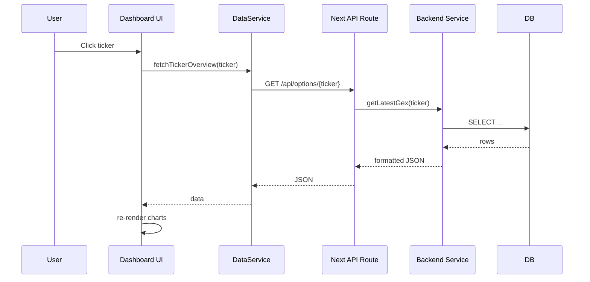

# Gamma Exposure Dashboard — Architecture & Function Map

This document maps the repository files to their primary responsibilities and main functions (inferred from file names and project structure). It also describes user interactions (what's clicked → what gets called) and the hierarchical organization of modules. Use this as a guide for refactoring, creating diagrams, or implementing the redesign.

Notes on scope and accuracy
- The map is based on the repository structure and filenames. When exact function names are unknown (not opened), I use best-effort, conservative inferred names and clear labels where you should verify the precise symbol names in the code.
- Wherever a function name is inferred, look for similarly named exports in the file (for example `collectData`, `getLatestData`, `fetchOptionChain`) and adjust the mapping if the repo uses different identifiers.

## High-level architecture

- Frontend (Next.js App Router) — `app/`, `components/`, `lib/`
- Backend API (Next.js serverless routes) — `app/api/*/route.ts`
- Backend service & DB (separate Node service) — `backend/src/...`
- Shared utilities — `lib/` and `backend/src/services/`

User interaction flows (summary):
- Dashboard UI (clicks, toggles) -> frontend component handlers -> `lib/data-service.ts` / `lib/backend-api.ts` -> Next.js API routes under `app/api/*` -> backend services in `backend/src/services/*` or database via `backend/db/*` -> returns JSON -> frontend sets state -> charts/components re-render.

## File-level map: backend

backend/
- package.json — project dependencies and scripts for backend service.
- src/server.ts — bootstraps the backend service. Likely responsibilities:
  - startServer() / main() — launch HTTP server or worker loop
  - scheduleCollectors() — set up cron/interval tasks to run data collection

### backend/src/db/connection.ts
- Responsibilities:
  - createConnection() / connect() — open DB connection (Postgres/SQLite)
  - query(sql, params) — thin wrapper for queries
  - close() — teardown connection

### backend/src/db/init.ts
- Responsibilities:
  - runMigrations() / initializeSchema() — apply schema in `schema.sql`
  - seedData() — optional seeds

### backend/src/db/schema.sql
- SQL schema for tables used by the service (tickers, options, gex data, snapshots).

### backend/src/services/dataCollector.ts
- Primary responsibilities (inferred): collect options and GEX data from external APIs and store them in DB.
- Main functions (likely):
  - fetchOptionChain(ticker, expiry?) — call external market data provider, return raw option chain
  - computeGexFromChain(chain) — compute gamma exposure metrics from option chain
  - saveGexSnapshot(ticker, expiry, computedGex) — upsert to DB
  - collectAllTickers() / collectTicker(ticker) — orchestrator that fetches, computes, and saves
  - scheduleCollector(interval) — scheduler wrapper (maybe in `server.ts` instead)

Interactions:
- Called by: `backend/src/server.ts` scheduled job or by an API route that triggers a manual refresh.
- Calls: external HTTP clients (fetch/axios), `db/connection` to persist data, local `utils` to transform data.

### backend/src/services/dataRetrieval.ts
- Primary responsibilities: read GEX and option-chain snapshots from the DB and return processed payloads for the frontend.
- Main functions (likely):
  - getLatestGex(ticker) — returns latest GEX summary for a ticker
  - getGexByExpiration(ticker, expiry) — returns per-expiration breakdown
  - getOptionChain(ticker, expiry) — returns raw or filtered option chain
  - queryTimeSeries(ticker, range) — historical snapshots

Interactions:
- Called by: Next.js API routes (app/api/*), possibly by internal backend routes.
- Calls: `db/connection` to run select queries, `utils` to format numbers/dates.

### backend/src/types/index.ts
- Shared TypeScript types used by backend services (Option, OptionChain, GexSnapshot, Ticker).

## File-level map: frontend (app, components, lib)

app/
- layout.tsx — top-level app layout (head, global wrappers).
- page.tsx — root page (dashboard entry).
- globals.css — tailwind / global styles.
- api/
  - options/[ticker]/route.ts — server route exposing options/GEX for ticker
  - india/[ticker]/route.ts — regional or variant route

components/
- Many dashboard components and chart components. Key files:
  - `dashboard-header.tsx` — header UI, likely contains navigation, refresh button, theme toggle.
  - `dashboard-shell.tsx` — shared layout for dashboard pages (sidebar + content grid).
  - `gamma-exposure-dashboard.tsx` — top-level dashboard composed of widgets.
  - `gamma-exposure-visualizer.tsx` — main visualization component, likely coordinates multiple charts.
  - `enhanced-time-machine.tsx` — controls time-based slicing of data (date picker / time travel), handler onTimeChange -> triggers data fetch with range.
  - `pricing-method-toggle.tsx` — toggles pricing or calculation methods. Emits onChange -> components re-compute or re-request data with different params.
  - Chart components (under `components/charts/`):
    - call-put-walls-chart.tsx
    - expected-move-chart.tsx
    - gamma-ramp-chart.tsx
    - gex-by-expiration-chart.tsx
    - gex-by-strike-chart.tsx
    - gex-data-graph-dashboard.tsx
    - gex-surface-chart.tsx
    - gex-surface.tsx
    - option-chain.tsx
    - total-gex-card.tsx

Each chart component responsibilities:
- Render a specific chart visualization.
- Accept props: data, loading, config (colors, domains).
- Provide interactions: onHover -> tooltip, onClick -> drill-down (if implemented).

components/ui/
- A large set of UI primitives (button, input, modal, table, etc.). Many of these are custom shadcn-like components. They are used throughout the dashboard but are candidates for consolidation.

hooks/
- `use-mobile.tsx`, `use-toast.ts` — small hooks for device detection and toast notifications.

lib/
- `backend-api.ts` — likely provides small wrappers for calling server routes (e.g., fetchOptions(ticker), fetchGex(ticker, params)).
- `calculations.ts` — core calculation functions (computeGexFromChain, computeExpectedMove, computeRamp). These are reused by frontend for local computations or for display formatting.
- `data-service.ts` — higher-level data fetching and caching layer used by components to request data.
- `types.ts` — shared TypeScript types for frontend components.
- `utils.ts` — formatters and small helpers (number formatting, date utils).

## Interaction / call-flow diagrams (textual)

Below are several detailed user-driven flows. Each step identifies the component/file and the function(s) called (inferred names). Use these to create visual diagrams (sequence diagrams) or to trace runtime calls.

Flow A — User clicks a ticker in the ticker list (open per-ticker dashboard)

1) UI component: `components/gamma-exposure-dashboard.tsx` or a TickerList component
   - Handler: onTickerClick(tickerSymbol)
2) Handler calls frontend router/navigation (Next.js `router.push(`/ticker/${ticker}`)`) or sets selectedTicker in global state (React context)
3) Dashboard page for that ticker mounts: `app/dashboard/[ticker]/page.tsx` or `app/page.tsx` with ticker param
4) Page uses `lib/data-service.ts` / `lib/backend-api.ts` to request data:
   - call: fetchTickerOverview(ticker) -> which calls `fetch('/api/options/' + ticker)` or uses the Next.js server route
5) Next.js API route: `app/api/options/[ticker]/route.ts` receives request
   - Handler function: GET -> validate params, call backend (if SSR proxy) or directly access DB/service
6) API route calls backend service (either via network to `backend/` or by invoking shared data access in repo): `backend/src/services/dataRetrieval.ts` functions such as getLatestGex(ticker), getOptionChain(ticker)
7) `dataRetrieval` queries DB via `db/connection.ts` -> SQL select -> returns rows
8) API route receives response, optionally formats, and returns JSON to frontend
9) Frontend `lib/data-service` receives JSON, normalizes into typed objects, and resolves the original fetch promise
10) Components receive data as props or via hook and re-render charts:
   - Chart components (e.g., `gex-by-strike-chart.tsx`) call Chart.js wrapper with datasets
11) User sees updated charts

Flow B — User clicks "Refresh" button in header

1) UI component: `components/dashboard-header.tsx` — onRefreshClick()
2) Function triggers: dataService.invalidateCache() or directly re-fetch:
   - call: dataService.fetchAllForCurrentTicker()
3) dataService uses `lib/backend-api.ts` to call multiple endpoints (overview, option chain, time series)
4) API routes (same as Flow A) call `dataRetrieval` or the backend service to return fresh data
5) Components update; header may show progress/toast via `use-toast.ts`

Flow C — Time-machine control: user selects a past date to view historical data

1) UI: `components/enhanced-time-machine.tsx` triggers onDateChange(dateRange)
2) Handler calls dataService.fetchHistorical(ticker, dateRange)
3) Frontend calls server: GET `/api/options/${ticker}?from=...&to=...` or a dedicated time series route
4) Server route calls `dataRetrieval.queryTimeSeries(ticker, range)`
5) `dataRetrieval` queries `db/connection` for historical snapshots and returns them
6) Frontend charts receive array of snapshots and re-render (some components may down-sample)

Flow D — Backend scheduled data collection

1) `backend/src/server.ts` on startup calls scheduler to run collector periodically
2) Scheduler triggers `backend/src/services/dataCollector.collectAllTickers()` at interval
3) `dataCollector` loops over configured tickers, calling `fetchOptionChain(ticker)` for each
4) For each chain, `dataCollector.computeGexFromChain(chain)` computes gex metrics
5) `dataCollector.saveGexSnapshot(ticker, expiry, computed)` writes results via `db/connection.ts`
6) Optionally: `dataCollector` publishes an event, or an index is updated for quick retrieval (materialized views)

## Hierarchy and modules

- App / Pages (Next.js App Router)
  - `app/layout.tsx` (global HTML, head, providers)
  - `app/page.tsx` (dashboard entry) -> composes `components/gamma-exposure-dashboard`
- UI components
  - `components/*` — high-level widgets and pages
  - `components/charts/*` — chart implementations (visual layer)
  - `components/ui/*` — primitives (buttons, inputs, etc.) — candidate for replacement
- Client utilities
  - `lib/backend-api.ts` — low-level fetch wrappers
  - `lib/data-service.ts` — caching, normalization, hooks-friendly interface
  - `lib/calculations.ts` — pure functions for GEX calculations (can be reused on backend or frontend)
- Backend service
  - `backend/src/services/*` — collectors and retrievers
  - `backend/src/db/*` — connection + schema

## Recommended next steps to make this map exact

1. Grep or open each file listed and extract actual exported function names. Replace the inferred names here with the exact identifiers.
2. Generate automated call-graphs using TypeScript language services or `madge` to visualize import graphs.
3. Add sequence diagrams (PlantUML or Mermaid) using the flows above.
4. Run static analysis (depcheck/ts-prune) to list unused exports and make the archive/delete list.

## Example Mermaid sequence (paste into a Mermaid renderer)

## Appendix — quick lookup table

| File | Primary responsibilities | Key functions (inferred) |
|---|---:|---|
| `app/api/options/[ticker]/route.ts` | HTTP API to expose options/GEX | GET handler -> calls dataRetrieval
| `backend/src/services/dataCollector.ts` | External fetch + compute + persist | fetchOptionChain, computeGexFromChain, saveGexSnapshot, collectAllTickers
| `backend/src/services/dataRetrieval.ts` | Query DB and return formatted data | getLatestGex, getGexByExpiration, getOptionChain, queryTimeSeries
| `lib/data-service.ts` | Client-side data fetching & caching | fetchTickerOverview, fetchHistorical, invalidateCache
| `lib/calculations.ts` | Pure calculation functions | computeGexFromChain, computeExpectedMove
| `components/gamma-exposure-dashboard.tsx` | Dashboard composition | onTickerClick, renderWidgets
| `components/charts/*.tsx` | Chart renderers | renderChart, onPointClick (optional)

--

If you'd like, I can now:

1. Run a static analysis pass to extract the exact function names and generate a precise call graph (recommended). (I will create a feature branch and save results to `tmp/`.)
2. Generate Mermaid/PlantUML diagrams for each flow and add them to this file.
3. Start implementing the UI architecture changes previously proposed.

Tell me which of the above you'd like me to do next; if you choose (1) I will run the analysis and update this document with exact function names and a generated call graph.
