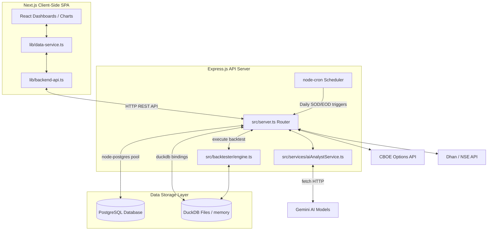
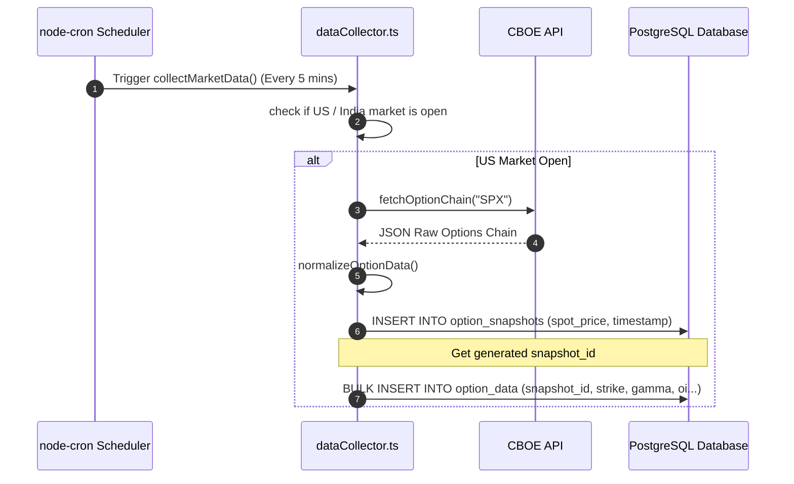
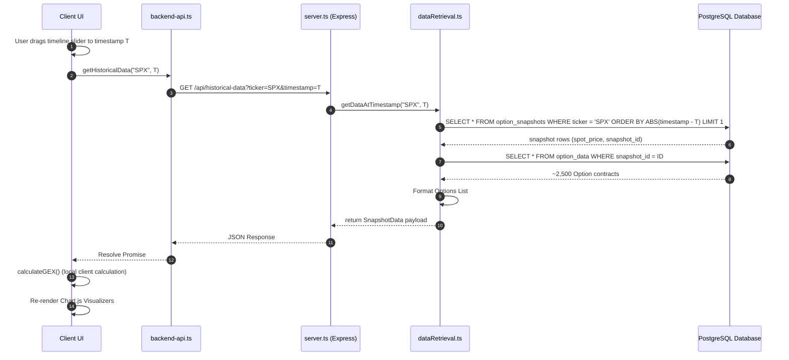
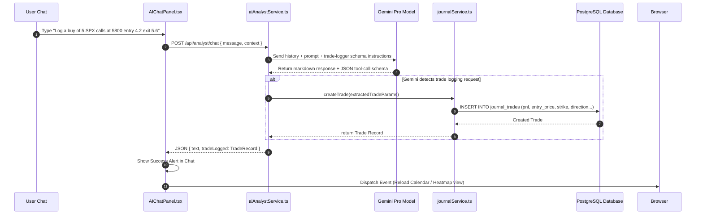
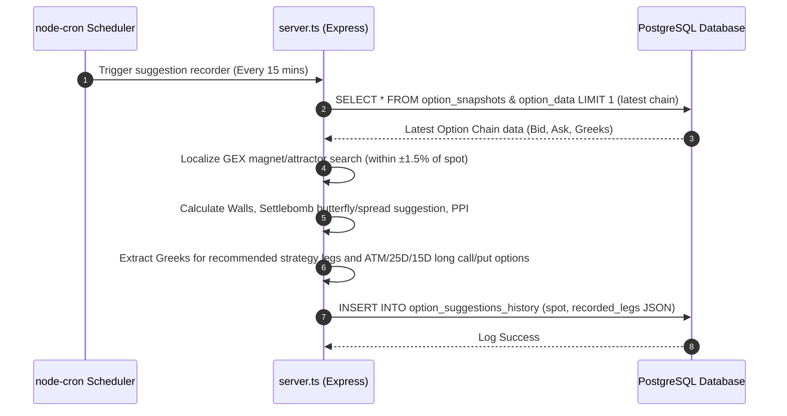

# System Overview & Macro Architecture

This document maps the global architecture of the Gamma Exposure Terminal Dashboard. It outlines how frontend and backend components interact, details the directories, and provides unified data flow sequence diagrams to serve as the master directory of truth.

---

## 🏗️ Macro-Architecture Architecture Diagram

---

## 🗂️ Codebase Directory Structure & Documentation Map

This project is separated into a Next.js frontend at the root and an Express.js backend inside the `backend/` folder. Use the index below to find detailed documents for each sub-system:

### 1. Root & Configuration
* [package.json](../package.json) — Frontend dependencies, Next.js build scripts.
* [tailwind.config.ts](../tailwind.config.ts) — Styling system, design tokens, color palette.
* [tsconfig.json](../tsconfig.json) — Frontend TypeScript compiler parameters.

### 2. Frontend Sub-systems
* **Detailed Guide**: **[FRONTEND_ARCHITECTURE.md](FRONTEND_ARCHITECTURE.md)**
* [app/](../app/) — Pages, layouts, Next.js routing.
* [components/](../components/) — Interactive UI dashboards and views.
  * [components/charts/](../components/charts/) — Recharts / Chart.js / Plotly wrappers for options metrics.
  * [components/confluence/](../components/confluence/) — Confluence matrices and 3D Surface charts.
  * [components/dashboard/](../components/dashboard/) — Performance stats dashboards.
  * [components/algorithms/](../components/algorithms/) — Backtester setups and drawer UI.
  * [components/trading-journal/](../components/trading-journal/) — Heatmaps, calendar grid, PnL charts.
* [lib/](../lib/) — Math calculation utilities, designs, and API clients.

### 3. Backend Sub-systems
* **Detailed Guide**: **[BACKEND_ARCHITECTURE.md](BACKEND_ARCHITECTURE.md)**
* [backend/package.json](../backend/package.json) — Backend dependency configuration.
* [backend/src/server.ts](../backend/src/server.ts) — Bootstrap server entry, cron setups, Express routes.
* [backend/src/services/](../backend/src/services/) — Options collection, journal syncing, and Gemini interactions.
* [backend/src/backtester/](../backend/src/backtester/) — DuckDB interface, simulation backtest loop.
* [backend/src/db/](../backend/src/db/) — Schema specifications, pool parameters, and table definitions.

### 4. Feature Guides Index
* **[features/market_data_collector.md](features/market_data_collector.md)**: Scrapers (NSE/Dhan, CBOE), Cron scheduler, Rates updating, DB Schema.
* **[features/gex_time_machine.md](features/gex_time_machine.md)**: GEX calculations math, timestamp caches, play/pause controller, visualizer charts.
* **[features/options_flow.md](features/options_flow.md)**: Sentiment models, aggregates, volume vs OI tracking.
* **[features/backtester.md](features/backtester.md)**: DuckDB database, strategy parsing, simulator engine, result plots.
* **[features/trading_journal.md](features/trading_journal.md)**: Calendar heatmaps, analytics dashboards, journal trade logs.
* **[features/ai_analyst.md](features/ai_analyst.md)**: AI trade logger, context building, Gemini chat logic.
* **[features/quant_pricing.md](features/quant_pricing.md)**: Breeden-Litzenberger implied probability density mapping, GARCH(1,1) volatility forecasting, Quantum Tunneling wall barrier breakthroughs, and CFTC COT macro positioning.

---

## ⚡ Core Integration Flows

### 1. Market Data Scraping & GEX Processing
This flow tracks the background collection and indexing of options data:

### 2. Time Machine Playback Replay
This flow traces how historical snapshots are retrieved when the user drags the Time Machine slider:

### 3. AI Chat to Trading Journal Flow
This flow tracks how natural language input results in a trade logged into the Database:

### 4. 0DTE Settlebomb Suggestion & Prints Recording Flow
This flow tracks the periodic logging of options engine suggestions and detailed Greeks:

