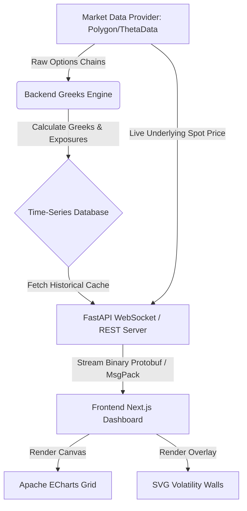

# Product Requirement Document (PRD)
## Real-Time Options Exposure (GEX/VEX) Visualization Dashboard

---

## 1. Executive Summary & Objective
The objective of this project is to develop a high-performance, institutional-grade options analytics dashboard (similar to VS3D/SpotGamma) that visualizes dealer positioning, hedging pressures (Gamma, Vanna, Charm), and key market support/resistance walls. 

The core feature of the dashboard is the **Gradient View (Heatmap)**, which plots options exposure along two axes—Time (X) and Strike Price (Y)—with exposure intensity represented by a color gradient (Z).

---

## 2. System Architecture Overview



---

## 3. Backend & Data Pipeline Requirements

To feed the dashboard, the backend must ingest raw options market data, calculate options Greeks in real-time, aggregate dealer exposure, and stream the resulting matrices to the client.

### 3.1. Data Ingestion
* **Required Sources**: Real-time OPRA options chain feeds (via providers like Theta Data, Polygon.io, or LiveVol) and underlying index/stock spot prices (SPX, VIX, QQQ, SPY).
* **Ingestion Fields**:
  * Strike Price
  * Expiration Date / Expiration Datetime
  * Bid/Ask/Mid Prices for Calls & Puts
  * Open Interest (OI) per contract (updated daily)
  * Volume per contract (updated intraday)

### 3.2. Options Greeks Calculation Engine
The system must calculate options Greeks for every strike and expiration. Standard models like **Black-Scholes-Merton** or numerical lattices can be used:
* **Inputs**: Spot Price ($S$), Strike ($K$), Time to Expiration ($T$), Risk-Free Rate ($r$), Dividend Yield ($q$), Implied Volatility ($\sigma$).
* **Outputs**:
  * **Gamma ($\Gamma$)**: Second derivative of option price with respect to underlying price.
  * **Vanna**: Sensitivity of Delta to volatility changes ($\frac{\partial \Delta}{\partial \sigma}$).
  * **Charm**: Sensitivity of Delta to time decay ($\frac{\partial \Delta}{\partial t}$).

### 3.3. Dealer Exposure Modeling
The system calculates Net Dealer Position under the standard assumption that retail traders buy options and institutional market makers (dealers) are on the sell side (short options).

| Metric | Calculation Formula | Purpose |
| :--- | :--- | :--- |
| **Gamma Exposure (GEX)** | $\text{GEX} = \text{Gamma} \times \text{Net Contracts} \times \text{Contract Multiplier} \times \text{Spot}$ | Represents local dealer buying/selling hedging pressure. |
| **Vanna Exposure (VEX)** | $\text{VEX} = \text{Vanna} \times \text{Net Contracts} \times \text{Contract Multiplier} \times \text{Spot}$ | Represents dealer hedging adjustments as market volatility rises/falls. |
| **Charm Exposure** | $\text{Charm} \times \text{Net Contracts} \times \text{Contract Multiplier} \times \text{Spot}$ | Tracks passive dealer decay hedging over weekends and time progression. |

*Note: For SPX, `Contract Multiplier = 100`. Net Contracts is calculated as `Calls - Puts` (under standard dealer short-put, long-call or net-short models).*

### 3.4. Binary Serialization & Streaming Protocol
To maintain low latency and reduce bandwidth when sending massive 3D data matrices:
* **Protocol**: WebSockets (`wss://`) for live pushes; HTTP REST for initial history load.
* **Format**: **Protocol Buffers (Protobuf)** or **MessagePack**.
* **WebSocket Message Types**:
  * `rpc_cache_getActiveProducts`: Returns active symbols (SPX, VIX).
  * `rpc_cache_getGreekSimulation`: Returns the historical matrix for the day.
  * `live_ohlc_1_minute`: Pushes live 1-minute updates.
* **Payload Structure**:
  ```protobuf
  message ExposurePoint {
      int64 timestamp = 1;
      double strike = 2;
      double gammaExposure = 3;
      double vannaExposure = 4;
      double charmExposure = 5;
  }
  ```

---

## 4. Frontend UI/UX Requirements

The frontend must handle high-frequency data updates and render complex visual grids efficiently without causing browser lag.

### 4.1. Core Component 1: The Gradient View (Heatmap)
* **Visualization Engine**: **Apache ECharts** (`echarts` with `ZRender` canvas renderer) for high-performance canvas plotting.
* **Axes Mapping**:
  * **X-Axis**: Time of day (intervals of 1-minute, 5-minutes, or 10-minutes).
  * **Y-Axis**: Option Strike Prices (grouped in increments of 5, 10, or 25 points).
  * **Z-Value (Color)**: Exposure value.
* **Color System (Diverging Scale)**:
  * **Teal (`#39c9c9`)**: High positive exposure (dealer buy-to-hedge zone).
  * **Dark Blue/Grey (`#0b0f19`)**: Zero/Neutral exposure zone.
  * **Pink/Red (`#bb045f`)**: High negative exposure (dealer sell-to-hedge volatility trigger zone).

### 4.2. Core Component 2: SVG Volatility Walls Overlay
An SVG graphic layer sits directly on top of the ECharts canvas to draw crisp, non-pixelated key boundaries that shift dynamically over time:
* **Spot Price Line**: A dashed white line (`stroke-dasharray="4 4"`) tracing the live index price.
* **Call Wall / Resistance**: A solid teal line (`#39c9c9`) tracing the strike with the largest positive gamma concentration.
* **Put Wall / Support**: A solid pink line (`#bb045f`) tracing the strike with the largest negative gamma concentration.

```
       STRIKE
         ▲
         │       [ Teal Solid Line: Call Wall / Upper Resistance ]
    7550 ┼───────────────────────────────────────────────────────────
         │
    7500 ┼ - - - - - - - - - - - - - - - - - - - - - - - - - - - - - 
         │      [ White Dashed Line: Live Underlying Spot Price ]
    7450 ┼───────────────────────────────────────────────────────────
         │       [ Pink Solid Line: Put Wall / Lower Support ]
         └───────────────────────────────────────────────────────────► TIME
           9:30 AM             12:00 PM                     4:00 PM
```

### 4.3. Interactive Toolbar & Utility Actions
* **View Switcher**: A dropdown menu that switches the Z-value rendering between **Gamma, Vanna, Charm, and Delta** instantly in-memory.
* **Zoom Controls**: Zoom In (`+`), Zoom Out (`-`), Reset Zoom, and Fit to View.
* **RTH (Regular Trading Hours) Filter**: A toggle button to restrict the chart timeline to RTH (9:30 AM – 4:00 PM ET) or display full extended-hours datasets.
* **Interactive Tooltip**: Hovering over the grid displays a custom overlay reading directly from the selected `[timestamp, strike]` object, showing the exact exposure values in dollars.

---

## 5. Technical Stack Recommendations

| Layer | Technology Options | Rationale |
| :--- | :--- | :--- |
| **Frontend** | React / Next.js (TypeScript) | Fast routing, component reusability, and fits the client's current setup. |
| **Styling** | TailwindCSS + Vanilla CSS Overlays | Modern visual style, layout positioning of overlays. |
| **Charting** | Apache ECharts (`echarts` & `zrender`) | Canvas-based rendering, highly performant with large datasets. |
| **Backend** | Python (FastAPI) or Go | Python allows easy access to mathematical libraries (SciPy, Pandas); Go provides faster WebSocket message throughput. |
| **Database** | ClickHouse or TimescaleDB | Columnar time-series database optimized for fast queries of massive options matrices. |
